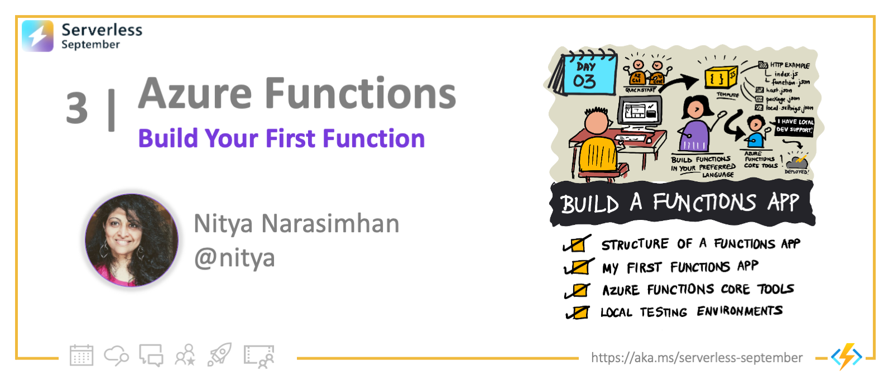
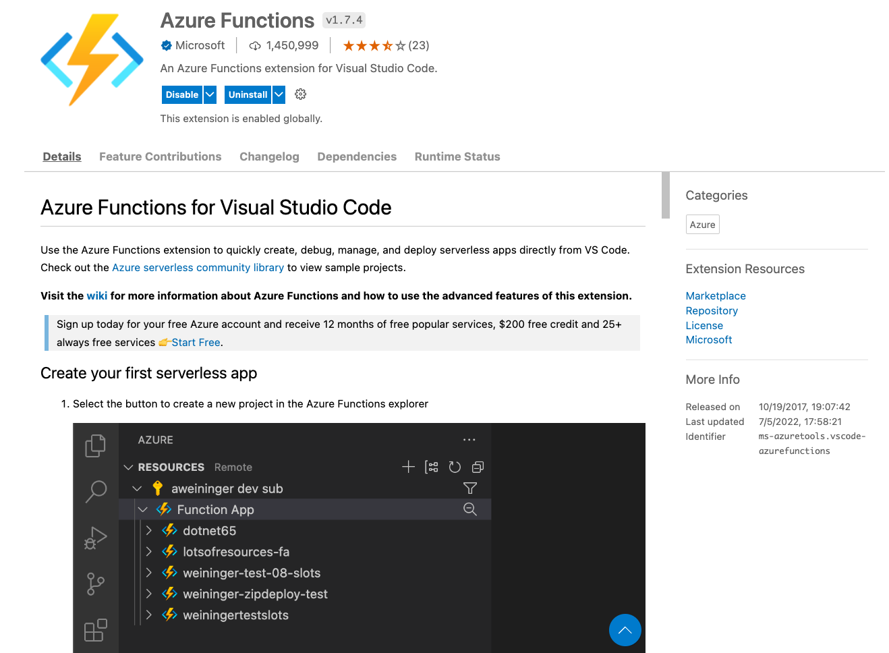
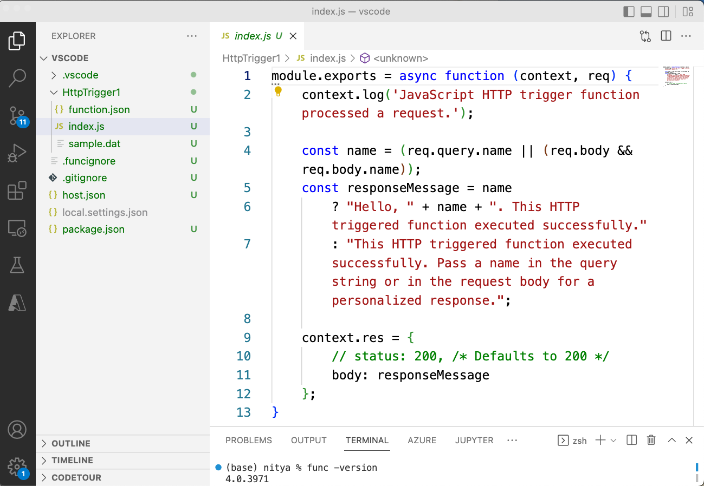
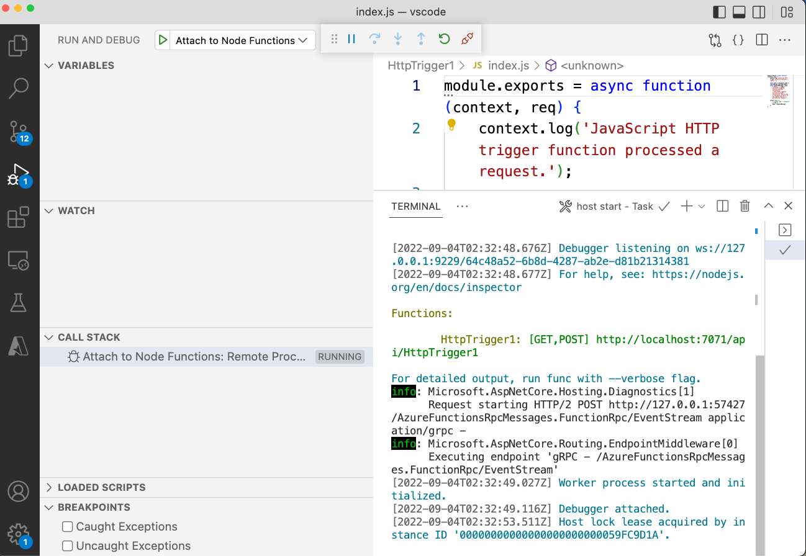
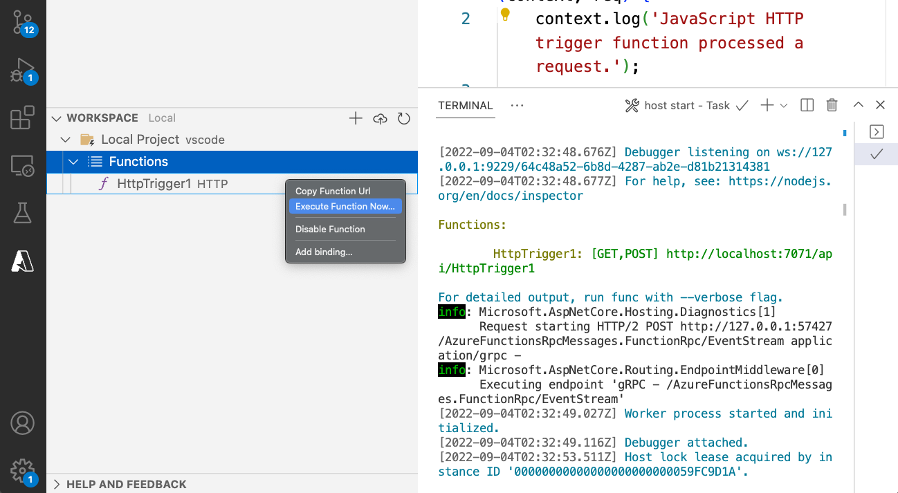
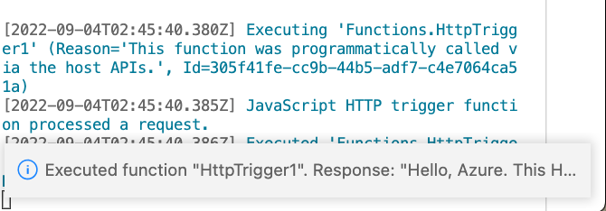

<head>
  <meta name="twitter:url" 
    content="https://azure.github.io/Cloud-Native/blog/03-functions-quickstart" />
  <meta name="twitter:title" 
    content="#30DaysOfServerless: Build Your First Function" />
  <meta name="twitter:description" 
    content="#30DaysOfServerless: Build Your First Function" />
  <meta name="twitter:image"
    content="https://azure.github.io/Cloud-Native/img/banners/post-kickoff.png" />
  <meta name="twitter:card" content="summary_large_image" />
  <meta name="twitter:creator" 
    content="@nitya" />
  <meta name="twitter:site" content="@AzureAdvocates" /> 
  <link rel="canonical" 
    href="https://azure.github.io/Cloud-Native/blog/03-functions-quickstart" />
</head>

---

Welcome to `Day 3` of #30DaysOfServerless!

_Yesterday_ we learned core concepts and terminology for Azure Functions, the signature _Functions-as-a-Service_ option on Azure. _Today_ we take our first steps into building and deploying an Azure Functions app, and validate local development setup.

Ready? Let's go.

---

## What We'll Cover

 * Review the [Azure Functions Developer Guide](https://docs.microsoft.com/azure/azure-functions/functions-reference?tabs=blob&WT.mc_id=javascript-74010-ninarasi)
 * Build your first Function App [with VS Code](https://docs.microsoft.com/azure/azure-functions/create-first-function-vs-code-node?WT.mc_id=javascript-74010-ninarasi)
 * Develop locally [using Azure Functions Core Tools](https://docs.microsoft.com/azure/azure-functions/functions-core-tools-reference?tabs=v2)
 * Review [Local Testing & Development](https://docs.microsoft.com/azure/azure-functions/functions-develop-local?WT.mc_id=javascript-74010-ninarasi) guidelines
 * Check out the [Durable Functions Quickstart](https://docs.microsoft.com/azure/azure-functions/durable/quickstart-js-vscode?WT.mc_id=javascript-74010-ninarasi)
 * **Exercise**: Take the [Cloud Skills Challenge](https://docs.microsoft.com/learn/challenges?id=b950cd7a-d456-46ab-81ba-3bd1ad86dc1c&WT.mc_id=javascript-74010-ninarasi)!
 * **Resources**: [#30DaysOfServerless Collection](https://aka.ms/30DaysOfServerless/collection).



---

## Developer Guidance

Before we jump into development, let's familiarize ourselves with language-specific guidance from the Azure Functions Developer Guide. We'll review the [JavaScript version](https://docs.microsoft.com/azure/azure-functions/functions-reference?tabs=blob&WT.mc_id=javascript-74010-ninarasi) but guides for F#, Java, Python, C# and PowerShell are also available.

 1. A **function** is defined by two things: _code_ (written in a supported programming language) and _configuration_ (specified in a `functions.json` file, declaring the triggers, bindings and other context for execution).

 2. A **function app** is the _unit of deployment_ for your functions, and is associated with a single execution context or runtime. It can contain multiple functions, but they _must_ be in the same language. 

 3. A **host configuration** is _runtime-specific configuration_ that affects all functions running in a given function app instance. It is defined in a `host.json` file.

 4. A recommended **folder structure** is defined for the function app, but may vary based on the programming language used. Check [the documentation on folder structures](https://docs.microsoft.com/azure/azure-functions/functions-reference?tabs=blob#folder-structure&WT.mc_id=javascript-74010-ninarasi) to learn the default for _your_ preferred language.

Here's an [example of the JavaScript folder structure](https://docs.microsoft.com/azure/azure-functions/functions-reference-node?WT.mc_id=javascript-74010-ninarasi) for a function app containing two functions with some shared dependencies. Note that `host.json` (runtime configuration) is defined once, in the root directory. And `function.json` is defined separately for each function.

```
FunctionsProject
 | - MyFirstFunction
 | | - index.js
 | | - function.json
 | - MySecondFunction
 | | - index.js
 | | - function.json
 | - SharedCode
 | | - myFirstHelperFunction.js
 | | - mySecondHelperFunction.js
 | - node_modules
 | - host.json
 | - package.json
 | - local.settings.json
```

We'll dive into what the contents of these files look like, when we build and deploy the first function. We'll cover `local.settings.json` in the _About Local Testing_ section at the end.

---

## My First Function App

The documentation provides **quickstart** options for all supported languages. We'll walk through the _JavaScript_ versions in this article. You have two options for development: 
  * using [Visual Studio Code](https://docs.microsoft.com/azure/azure-functions/create-first-function-vs-code-node) for an IDE-driven experience
  * using [Azure CLI](https://docs.microsoft.com/azure/azure-functions/create-first-function-cli-node?tabs=azure-cli%2Cbrowser) for a commandline-driven experience.

I'm a huge fan of VS Code - so I'll be working through that tutorial today. 

:::info PRE-REQUISITES

 * Have an Azure account (with active subscription) | **[Create one for free](https://azure.microsoft.com/free/?ref=microsoft.com&utm_source=microsoft.com&utm_medium=docs&utm_campaign=visualstudio)**
 * Install Azure Functions Core Tools | **[Verify it's version 4.x](https://docs.microsoft.com/azure/azure-functions/functions-run-local#v2)**
 * Install Azure Functions VS Code Extension | **[Currently v 1.7.4](https://marketplace.visualstudio.com/items?itemName=ms-azuretools.vscode-azurefunctions)**
 * Install Node.js v16 or v18 (preview) | **[Manage versions with NVM](https://github.com/nvm-sh/nvm)**

Don't forget to validate your setup by checking the versions of installed software.
:::

### Install VSCode Extension
Installing the Visual Studio Code extension should automatically open this page in your IDE with similar quickstart instructions, but potentially more recent screenshots.



 Note that it may make sense to install the [Azure tools for Visual Studio Code](https://marketplace.visualstudio.com/items?itemName=ms-vscode.vscode-node-azure-pack) extensions pack if you plan on working through the many projects in Serverless September. This includes the Azure Functions extension by default.

### Create First Function App

Walk through the [Create local [project]](https://docs.microsoft.com/azure/azure-functions/create-first-function-vs-code-node#create-an-azure-functions-project) steps of the quickstart. The process is quick and painless and scaffolds out this folder structure and files. Note the existence (and locations) of `functions.json` and `host.json` files.

 

### Explore the Code

**Check out the `functions.json` configuration file.** It shows that the function is activated by an `httpTrigger` with an input binding (tied to `req` payload) and an output binding (tied to `res` payload). And it supports both GET and POST requests on the exposed URL.

```json
{
  "bindings": [
    {
      "authLevel": "anonymous",
      "type": "httpTrigger",
      "direction": "in",
      "name": "req",
      "methods": [
        "get",
        "post"
      ]
    },
    {
      "type": "http",
      "direction": "out",
      "name": "res"
    }
  ]
}
```

**Check out `index.js` - the function implementation**. We see it logs a message to the console when invoked. It then extracts a `name` value from the input payload (req) and crafts a different `responseMessage` based on the presence/absence of a valid name. It returns this response in the output payload (res).

```js
module.exports = async function (context, req) {
    context.log('JavaScript HTTP trigger function processed a request.');

    const name = (req.query.name || (req.body && req.body.name));
    const responseMessage = name
        ? "Hello, " + name + ". This HTTP triggered function executed successfully."
        : "This HTTP triggered function executed successfully. Pass a name in the query string or in the request body for a personalized response.";

    context.res = {
        // status: 200, /* Defaults to 200 */
        body: responseMessage
    };
}
```

### Preview Function App Locally

You can now run this function app locally using [Azure Functions Core Tools](https://docs.microsoft.com/azure/azure-functions/functions-run-local). VS Code integrates seamlessly with this CLI-based tool, making it possible for you to exploit all its capabilities without leaving the IDE. In fact, the workflow will even prompt you to _install_ those tools if they didn't already exist in your local dev environment.

Now run the function app locally by clicking on the "Run and Debug" icon in the activity bar (highlighted, left) and pressing the "▶️" (`Attach to Node Functions`) to start execution. On success, your console output should show something like this. 

 

You can test the function locally by visiting the Function Url shown (`http://localhost:7071/api/HttpTrigger1`) or by opening the _Workspace_ region of the Azure extension, and selecting the `Execute Function now` menu item as shown.

 

In the latter case, the `Enter request body` popup will show a pre-populated request of `{"name":"Azure"}` that you can submit. 

 
 
 On successful execution, your VS Code window will show a notification as follows. Take note of the console output - it shows the message encoded in `index.js`.

 

You can also visit the deployed function URL directly in a local browser - testing the case for a request made with no `name` payload attached. Note how the response in the browser now shows the non-personalized version of the message!

 


:::success 🎉 **Congratulations**
You created and ran a function app locally!
:::

### (Re)Deploy to Azure

Now, just follow the [creating a function app in Azure](https://docs.microsoft.com/azure/azure-functions/create-first-function-vs-code-node#publish-the-project-to-azure) steps to deploy it to Azure, using an active subscription! The deployed app resource should now show up under the `Function App` Resources where you can click `Execute Function Now` to test the Azure-deployed version instead. You can also look up the function URL in the portal and visit that link in your local browser to trigger the function without the name context.


:::success 🎉 **Congratulations**
You have an Azure-hosted serverless function app!
:::


Challenge yourself and try to [change the code and redeploy](https://docs.microsoft.com/azure/azure-functions/create-first-function-vs-code-node#run-the-function-in-azure) to Azure to return something different. _You have effectively created a serverless API endpoint!_ 

---

## About Core Tools

That was a lot to cover! In the next few days we'll have more examples for Azure Functions app development - focused on different programming languages. So let's wrap today's post by reviewing two helpful resources.

First, let's talk about [Azure Functions Core Tools](https://docs.microsoft.com/azure/azure-functions/functions-core-tools-reference?tabs=v2) - the command-line tool that lets you develop, manage, and deploy, Azure Functions projects from your **local development environment**. It is used transparently by the VS Code extension - but you can use it directly from a terminal for a powerful command-line end-to-end developer experience! The Core Tools commands are organized into the following contexts:
 
  * [`func`](https://docs.microsoft.com/azure/azure-functions/functions-core-tools-reference?tabs=v2#func-init) - commands to create and run functions locally
  * [`func azure`](https://docs.microsoft.com/azure/azure-functions/functions-core-tools-reference?tabs=v2#func-azure-functionapp-fetch-app-settings) - work with resource slike Azure Functions and Azure Storage
  * [`func durable`](https://docs.microsoft.com/azure/azure-functions/functions-core-tools-reference?tabs=v2#func-durable-delete-task-hub) - work with Durable Functions
  * [`func extensions`](https://docs.microsoft.com/azure/azure-functions/functions-core-tools-reference?tabs=v2#func-extensions-install) - manage extensions (default nuget.org)
  * [`func kubernetes`](https://docs.microsoft.com/azure/azure-functions/functions-core-tools-reference?tabs=v2#func-kubernetes-deploy) - work with Kubernetes and Azure Functions
  * [`func settings`](https://docs.microsoft.com/azure/azure-functions/functions-core-tools-reference?tabs=v2#func-settings-decrypt) - manage environment settings for local Functions host
  * [`func templates`](https://docs.microsoft.com/azure/azure-functions/functions-core-tools-reference?tabs=v2#func-templates-list) - list available templates

Learn how to [work with Azure Functions Core Tools](https://docs.microsoft.com/azure/azure-functions/functions-run-local?tabs=v4%2Cmacos%2Ccsharp%2Cportal%2Cbash). Not only can it help with quick command execution, it can also be invaluable for debugging issues that may not always be visible or understandable in an IDE.

## About Local Testing

You might have noticed that the scaffold also produced a `local.settings.json` file. What is that and why is it useful? By definition, the local.settings.json file _"stores app settings and settings used by local development tools. Settings in the local.settings.json file are used only when you're running your project locally."_

Read the guidance on [Code and test Azure Functions Locally](https://docs.microsoft.com/azure/azure-functions/functions-develop-local?WT.mc_id=javascript-74010-ninarasi#local-settings-file) to learn more about how to configure development environments locally, for your preferred programming language, to support testing and debugging on the local Functions runtime.

## Exercise
We made it! Now it's your turn!! Here are a few things you can try to apply what you learned and reinforce your understanding:
 * Walk through this quickstart on your own!
 * Then try the [Durable Functions Quickstart](https://docs.microsoft.com/azure/azure-functions/durable/quickstart-js-vscode?WT.mc_id=javascript-74010-ninarasi) as a stretch goal!
 * And take the [Cloud Skills Challenge](https://docs.microsoft.com/learn/challenges?id=b950cd7a-d456-46ab-81ba-3bd1ad86dc1c&WT.mc_id=javascript-74010-ninarasi) to skill up in fun ways

## Resources

Bookmark and visit the [#30DaysOfServerless Collection](https://aka.ms/30DaysOfServerless/collection). It's the one-stop collection of resources we will keep updated with links to relevant documentation and learning resources.