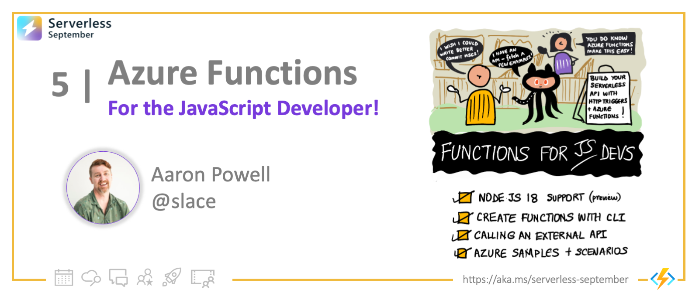
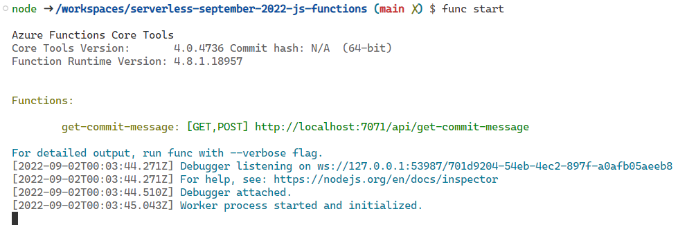
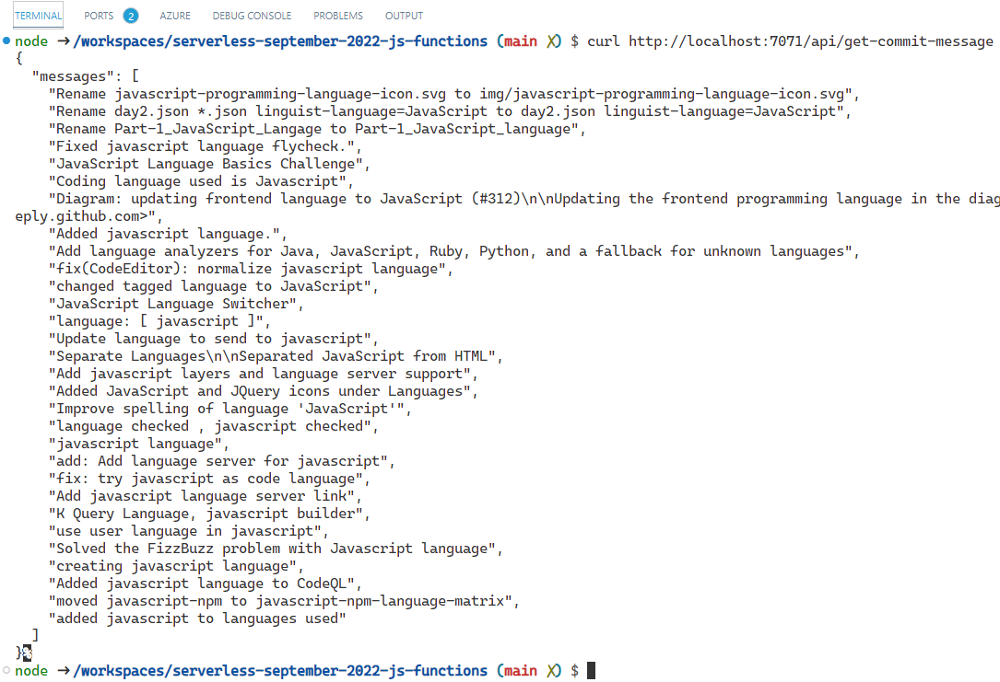

<head>
  <meta name="twitter:url" 
    content="https://azure.github.io/Cloud-Native/blog/functions-1" />
  <meta name="twitter:title" 
    content="#30DaysOfServerless: Azure Functions Fundamentals" />
  <meta name="twitter:description" 
    content="#30DaysOfServerless: Azure Functions Fundamentals" />
  <meta name="twitter:image"
    content="https://azure.github.io/Cloud-Native/img/banners/post-kickoff.png" />
  <meta name="twitter:card" content="summary_large_image" />
  <meta name="twitter:creator" 
    content="@nitya" />
  <meta name="twitter:site" content="@AzureAdvocates" /> 
  <link rel="canonical" 
    href="https://azure.github.io/Cloud-Native/blog/05-functions-js" />
</head>

---

Welcome to `Day 5` of #30DaysOfServerless!

The theme for this week is Azure Functions. We'll talk about building a serverless HTTP API using JavaScript.

---

## What We'll Cover
 * Creating an Azure Function
 * Adding a HTTP Trigger
 * Calling an external API
 * Exercise: Support searching
 * Resources: For self-study!



---

As we continue to explore how we can use Azure Functions, today we're going to look at using JavaScript to create one, and we're going to be using the newly release [Node.js 18 support for Azure Functions](https://azure.microsoft.com/updates/public-preview-nodejs-18-in-azure-functions/) to make the most out of the platform.

The application we're going to be building today will use the GitHub API to return a random commit message, so that we don't need to come up with one ourselves! After all, naming things can be really hard! 🤣 

Ensure you have Node.js 18 installed, a text editor (I'll use VS Code in this post), and a terminal, then we're ready to go.

## Creating an Azure Function

To create our Azure Function, we're going to use the [Azure Functions CLI](https://docs.microsoft.com/azure/azure-functions/functions-run-local?tabs=v4%2Cwindows%2Ccsharp%2Cportal%2Cbash), which we can install using npm:

```bash
npm install --global azure-function-core-tools
```

Once that's installed, we can use the new `func` command to initalise our project:

```bash
func init --worker-runtime node --language javascript
```

When running `func init` we can either provide the `worker-runtime` and `language` as arguments, or use the menu system that the tool will provide us. For brevity's stake, I've used the arguments here, specifying that we want `node` as the runtime and `javascript` as the language, but you could change that to `typescript` if you'd prefer to use TypeScript.

Once the `init` command is completed, you should have a `.vscode` folder, and the files `.gitignore`, `host.json`, `local.settings.json`, and `package.json`.


## Adding a HTTP Trigger

We have an empty Functions app so far, what we need to do next is create a Function that it will run, and we're going to make a HTTP Trigger Function, which is a Function that responds to HTTP requests. We'll use the `func new` command to create that:

```bash
func new --template "HTTP Trigger" --name "get-commit-message"
```

When this completes, we'll have a folder for the Function, using the name we provided, that contains the files`function.json` and `index.js`. Let's open the `function.json` to understand it a little bit:

```json
{
  "bindings": [
    {
      "authLevel": "function",
      "type": "httpTrigger",
      "direction": "in",
      "name": "req",
      "methods": [
        "get",
        "post"
      ]
    },
    {
      "type": "http",
      "direction": "out",
      "name": "res"
    }
  ]
}
```

This file is used to tell Functions about the Function that we've created and what it does, so it knows to handle the appropriate events. We have a `bindings` node which contains the event bindings for our Azure Function. The first binding is using the `type` `httpTrigger`, which indicates that it'll be executed, or _triggered_, by a HTTP event, and the `methods` indicates that it's listening to both **GET** and **POST** (you can change this for the right HTTP methods that you want to support). The HTTP request information will be bound to a property in the Functions context called `req`, so we can access query strings, the request body, etc.

The other binding we have has the direction of `out`, meaning that it's something that the Function will _return_ to the called, and since this is a HTTP API, the `type` is `http`, indicating that we'll return a HTTP response, and that response will be on a property called `res` that we add to the Functions context.

Let's go ahead and start the Function and call it:

```bash
func start
```



With the Function started, access the endpoint `http://localhost:7071/api/get-commit-message` via a browser or using `cURL`:

```bash
curl http://localhost:7071/api/get-commit-message\?name\=ServerlessSeptember
```


## Calling an external API

It's time to update the Function to do what we want to do - call the GitHub Search API and get some commit messages. The endpoint that we'll be calling is [https://api.github.com/search/commits?q=language:javascript](https://api.github.com/search/commits?q=language:javascript).

_Note: The GitHub API is [rate limited](https://docs.github.com/en/rest/overview/resources-in-the-rest-api#rate-limiting) and this sample will call it unauthenticated, so be aware of that in your own testing._

To call this API, we'll leverage the newly released [`fetch` support in Node 18](https://nodejs.org/en/blog/announcements/v18-release-announce/#fetch-experimental) and `async`/`await`, to make for a very clean Function.

Open up the `index.js` file, and delete the contents of the existing `Function`, so we have a empty one:

```javascript
module.exports = async function (context, req) {

}
```

_The default template uses CommonJS, but you can use ES Modules with Azure Functions if you prefer._

Now we'll use `fetch` to call the API, and unpack the JSON response:

```javascript
module.exports = async function (context, req) {
    const res = await fetch("https://api.github.com/search/commits?q=language:javascript");
    const json = await res.json();
    const messages = json.items.map(item => item.commit.message);
    context.res = {
        body: {
            messages
        }
    };
}
```

To send a response to the client, we're setting the `context.res` property, where `res` is the name of the output binding in our `function.json`, and giving it a body that contains the commit messages.

Run `func start` again, and call the endpoint:

```bash
curl http://localhost:7071/api/get-commit-message
```

The you'll get some commit messages:



🎉 There we go, we've created an Azure Function which is used as a proxy to another API, that we call using native `fetch` in Node.js 18, and return a subset of the JSON payload.

## Exercise - Support searching

The GitHub Serach API allows you to provide search parameters via the `q` query string. In this sample, we hard-coded it to be `language:javascript`, but as a follow-on exercise, expand the Function to allow the caller to provide the search terms as a query string to the Azure Function, which is passed to the GitHub Search API. Hint - have a look at the `req` argument.

## Resources

- [Public preview of Node.js 18 for Azure Functions](https://azure.microsoft.com/updates/public-preview-nodejs-18-in-azure-functions/)
- [`fetch` support in Node.js 18](https://nodejs.org/en/blog/announcements/v18-release-announce/#fetch-experimental)
- [Refactor Node.js and Express APIs to Serverless APIs with Azure Functions](https://docs.microsoft.com/learn/modules/shift-nodejs-express-apis-serverless/)
