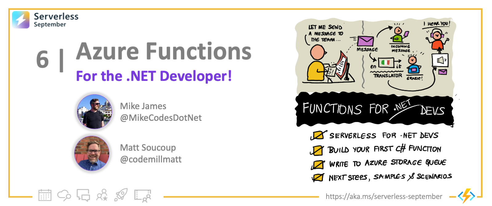
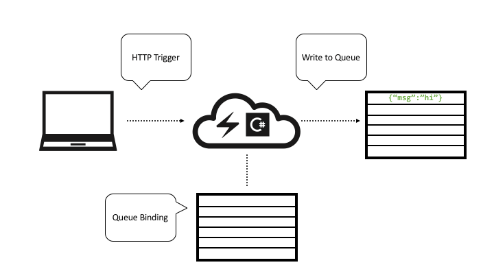
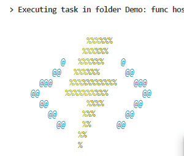
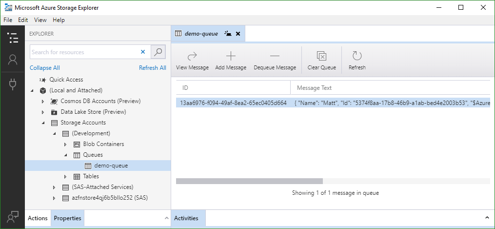

<head>
  <meta name="twitter:url" 
    content="https://azure.github.io/Cloud-Native/blog/functions-1" />
  <meta name="twitter:title" 
    content="#30DaysOfServerless: Azure Functions Fundamentals" />
  <meta name="twitter:description" 
    content="#30DaysOfServerless: Azure Functions Fundamentals" />
  <meta name="twitter:image"
    content="https://azure.github.io/Cloud-Native/img/banners/post-kickoff.png" />
  <meta name="twitter:card" content="summary_large_image" />
  <meta name="twitter:creator" 
    content="@nitya" />
  <meta name="twitter:site" content="@AzureAdvocates" /> 
  <link rel="canonical" 
    href="https://azure.github.io/Cloud-Native/blog/06-functions-dotnet" />
</head>

---

Welcome to `Day 6` of #30DaysOfServerless!

The theme for this week is Azure Functions. Today we're going to talk about why Azure Functions are a great fit for .NET developers.

---

## What We'll Cover

* What is serverless computing? How does Azure Functions fit in?
* Let's build a simple Azure Function in .NET
* Resources: For self-study!



---

The leaves are changing colors and there's a chill in the air, or for those lucky folks in the Southern Hemisphere, the leaves are budding and a warmth is in the air. Either way, that can only mean one thing - it's Serverless September!

Today we're going to take a look at Azure Functions, what they are, and why they're a great fit for .NET developers.

## What is serverless computing?

For developers, serverless computing means you write highly compact individual functions that do one thing - and run in the cloud. These functions are triggered by some external event. That event could be a record being inserted into a database, a file uploaded into BLOB storage, a timer interval elapsed, or even a simple HTTP request.

But... servers are still definitely involved! What has changed - from other types of cloud computing - is that the idea and ownership of the server has been abstracted away.

A lot of the time you'll hear folks refer to this as Functions as a Service or FaaS. The defining characteristic is all you need to do is put together your application logic - and your code is going to be invoked in response to events - and the cloud provider takes care of everything else. You literally get to focus on only the business logic you need to run in response to something of interest - no worries about hosting.

You do not need to worry about wiring up the plumbing between the service that originates the event and the serverless runtime environment. The cloud provider will handle the mechanism to call your function in response to whatever event you chose to have the function react to. And it passes along any data that is relevant to the event to your code.

And here's a really neat thing. You only pay for the time the serverless function is running. So, if you have a function that is triggered by an HTTP request, and you rarely get requests to your function, you would rarely pay.

### How does Azure Functions fit in?

Microsoft's [Azure Functions](https://docs.microsoft.com/azure/azure-functions/) is a modern serverless architecture, offering event-driven cloud computing that is easy for developers to use. It provides a way to run small pieces of code or Functions in the cloud without developers having to worry themselves about the infrastructure or platform the Function is running on.

That means we're only concerned about writing the logic of the Function. And we can write that logic in our choice of languages... like C#. We are also able to add packages from NuGet to Azure Functions—this way, we don't have to reinvent the wheel and can use well-tested libraries.

And the Azure Functions runtime takes care of a ton of neat stuff for us, like passing in information about the event that caused it to kick off - in a strongly typed variable. It also ["binds"](https://docs.microsoft.com/azure/azure-functions/functions-triggers-bindings) to other services, like Azure Storage, we can easily access those services from our code without having to worry about new'ing them up.

## Let's build an Azure Function!

### Scaffolding the Function out

Don't worry about having an Azure subscription or even being connected to the internet—we can develop and debug Azure Functions locally using either [Visual Studio](https://docs.microsoft.com/azure/azure-functions/functions-develop-vs?tabs=in-process) or [Visual Studio Code](https://docs.microsoft.com/azure/azure-functions/functions-develop-vs-code?tabs=csharp)!

For this example, I'm going to use Visual Studio Code to build up a Function that responds to an [HTTP trigger](https://docs.microsoft.com/azure/azure-functions/functions-bindings-http-webhook-trigger) and then writes a message to an [Azure Storage Queue](https://docs.microsoft.com/azure/azure-functions/functions-bindings-storage-queue-output).



The incoming HTTP call is the **trigger** and the message queue the Function writes to is an **output binding**. Let's have at it!

You do need to have some tools downloaded and installed to get started. First and foremost, you'll need [Visual Studio Code](https://code.visualstudio.com/). Then you'll need the [Azure Functions extension](https://marketplace.visualstudio.com/items?itemName=ms-azuretools.vscode-azurefunctions) for VS Code to do the development with. Finally, you'll need the [Azurite Emulator](https://docs.microsoft.com/azure/storage/common/storage-use-azurite?tabs=visual-studio-code) installed as well—this will allow us to write to a message queue locally.

Oh! And of course, [.NET 6](https://docs.microsoft.com/dotnet/core/tools/)!

Now with all of the tooling out of the way, let's write a Function!

First, fire up Visual Studio Code. Then, from the command palette, type: `Azure Functions: Create New Project`


Then follow the steps as to which directory you want to create the project in and which .NET runtime and language you want to use.


Pick **.NET 6** and **C#**.

It will then prompt you to pick the folder in which your Function app resides and then select a template.


Pick the **HTTP trigger** template. And when prompted for a name, call it: **PostToAQueue**.

After giving it a namespace, it prompts for an authorization level—pick Anonymous.

Now we have a Function! Let's go ahead and hit F5 and see it run!

> Note: After the templates have finished installing, you may get a prompt to download additional components—these are NuGet packages. Go ahead and do that.

After it starts, you'll see the Azure Functions logo appear in the Terminal window and then URL the Function is located at.



In a web browser, we'll type in: `http://localhost:7071/api/PostToAQueue?name=Matt` and the Function will respond. You can even set breakpoints in Visual Studio Code and step through the code!

### Writing to a queue

Next, we'll get this HTTP trigger Function to write to a local Azure Storage Queue.

First we need to add the Storage NuGet package to our project. In the terminal, type:

```bash
dotnet add package Microsoft.Azure.WebJobs.Extensions.Storage
```

Then set a configuration setting to tell the Function runtime where to find the Storage. Open up local.settings.json and set "AzureWebJobsStorage" to "UseDevelopmentStorage=true". The full file will look like:

```json
{
  "IsEncrypted": false,
  "Values": {
    "AzureWebJobsStorage": "UseDevelopmentStorage=true",
    "AzureWebJobsDashboard": ""
  }
}
```

Then create a new class within your project. This class will hold nothing but properties. Call it whatever you want and add whatever properties you want to it. I called mine TheMessage and added an Id and Name properties to it.

```csharp
public class TheMessage
{
    public string Id { get; set; }
    public string Name { get; set; }
}
```

Finally, change your PostToAQueue Function, so it looks like the following:

```csharp

public static class PostToAQueue
{
    [FunctionName("PostToAQueue")]        
    public static async Task<IActionResult> Run(
        [HttpTrigger(AuthorizationLevel.Anonymous, "get", "post", Route = null)] HttpRequest req,
        [Queue("demoqueue", Connection = "AzureWebJobsStorage")] IAsyncCollector<TheMessage> messages,
        ILogger log)
    {        
        string name = req.Query["name"];

        await messages.AddAsync(new TheMessage { Id = System.Guid.NewGuid().ToString(), Name = name });

        return new OkResult();
    }
}

```

Note the addition of the `messages` variable. This is telling the Function to use the storage connection we specified before via the `Connection` property. And it is also specifying which queue to use in that storage account, in this case `demoqueue`.

All the code is doing is pulling out the `name` from the query string, new'ing up a new `TheMessage` class and adding that to the `IAsyncCollector` variable.

That will add the new message to the queue!

Make sure Azurite is started within VS Code (both the queue and blob emulators). Run the app and send the same GET request as before: `http://localhost:7071/api/PostToAQueue?name=Matt`.

If you have the Azure Storage Explorer installed, you can browse your local Queue and see the new message in there!



## Summing Up

We had a quick look at what Microsoft's serverless offering, Azure Functions, is comprised of. It's a full-featured FaaS offering that enables you to write functions in your language of choice, including reusing packages such as those from NuGet.

A highlight of Azure Functions is the way they are triggered and bound. The triggers define how a Function starts, and bindings are akin to input and output parameters on it that correspond to external services. The best part is that the Azure Function runtime takes care of maintaining the connection to the external services so you don't have to worry about new'ing up or disposing of the connections yourself. We then wrote a quick Function that gets triggered off an HTTP request and then writes a query string parameters from that request into a local Azure Storage Queue.

## Resources
