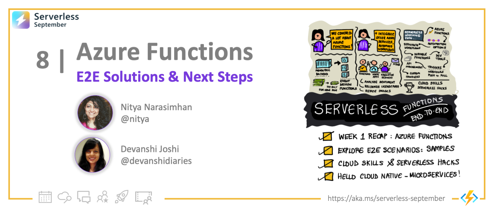
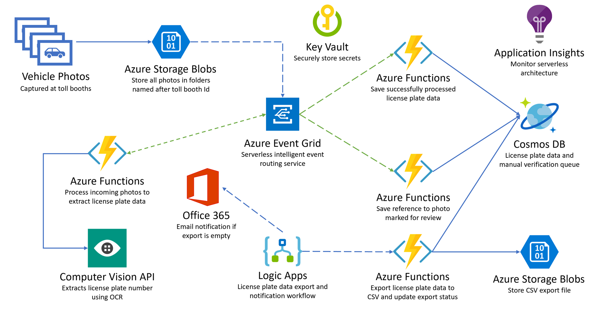
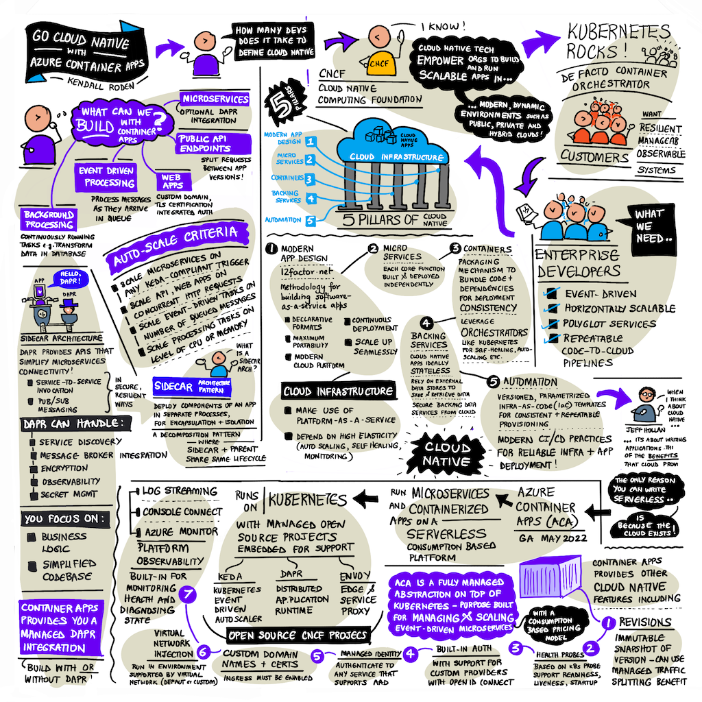

<head>
  <meta name="twitter:url" 
    content="https://azure.github.io/Cloud-Native/blog/functions-1" />
  <meta name="twitter:title" 
    content="#30DaysOfServerless: Azure Functions Fundamentals" />
  <meta name="twitter:description" 
    content="#30DaysOfServerless: Azure Functions Fundamentals" />
  <meta name="twitter:image"
    content="https://azure.github.io/Cloud-Native/img/banners/post-kickoff.png" />
  <meta name="twitter:card" content="summary_large_image" />
  <meta name="twitter:creator" 
    content="@nitya" />
  <meta name="twitter:site" content="@AzureAdvocates" /> 
  <link rel="canonical" 
    href="https://azure.github.io/Cloud-Native/blog/08-functions-azure" />
</head>

---
:::warning SEP 08: CHANGE IN PUBLISHING SCHEDULE

Starting from Week 2 (Sep 8), we'll be publishing blog posts in _batches_ rather than on a daily basis, so you can read a series of related posts together. _Don't want to miss updates?_ Just [subscribe to the feed](https://azure.github.io/Cloud-Native/blog/rss.xml)
:::

---

Welcome to `Day 8` of #30DaysOfServerless!

This marks the end of our [Week 1 Roadmap](https://azure.github.io/Cloud-Native/serverless-september/30DaysOfServerless/#azure-functions) focused on Azure Functions!! Today, we'll do a quick recap of all #ServerlessSeptember activities in Week 1, set the stage for Week 2 - and leave you with some excellent tutorials you should explore to build more advanced scenarios with Azure Functions.

Ready? Let's go.

---

## What We'll Cover
 * Azure Functions: Week 1 Recap
 * Advanced Functions: Explore Samples
 * End-to-End: Serverless Hacks & Cloud Skills
 * What's Next: Hello, Containers & Microservices
 * Challenge: [Complete the Learning Path](https://docs.microsoft.com/training/paths/create-serverless-applications/?WT.mc_id=javascript-74010-cxa)

---

## Week 1 Recap: #30Days & Functions

Congratulations!! We made it to the end of Week 1 of #ServerlessSeptember. Let's recap what we learned so far:

 * In [Core Concepts](/blog/02-functions-intro) we looked at where Azure Functions fits into the serverless options available on Azure. And we learned about key concepts like Triggers, Bindings, Custom Handlers and Durable Functions.
 * In [Build Your First Function](/blog/03-functions-quickstart) we looked at the tooling options for creating Functions apps, testing them locally, and deploying them to Azure - as we built and deployed our first Functions app.
 * In the next 4 posts, we explored new Triggers, Integrations, and Scenarios - as we looked at building Functions Apps in Java, JavaScript, .NET and Python.
 * And in the Zero-To-Hero series, we learned about [Durable Entities](/blog/zero2hero-func-02) - and how we can use them to create _stateful_ serverless solutions using a [Chirper Sample](https://github.com/Azure/azure-functions-durable-extension/tree/dev/samples/entitites-csharp/Chirper) as an example scenario.

The illustrated roadmap below summarizes what we covered each day this week, as we bring our **Functions-as-a-Service** exploration to a close.

---

## Advanced Functions: Code Samples

So, now that we've got our first Functions app under our belt, and validated our local development setup for tooling, where can we go next? A good next step is to explore different triggers and bindings, that drive richer end-to-end scenarios. For example:

 * [**Integrate Functions with Azure Logic Apps**](https://docs.microsoft.com/azure/azure-functions/functions-twitter-email?WT.mc_id=javascript-74010-cxa) - we'll discuss Azure Logic Apps in Week 3. For now, think of it as a [workflow automation](https://docs.microsoft.com/azure/logic-apps/logic-apps-overview?WT.mc_id=javascript-74010-cxa) tool that lets you integrate seamlessly with other supported Azure services to drive an end-to-end scenario. In this tutorial, we set up a workflow connecting Twitter (get tweet) to Azure Cognitive Services (analyze sentiment) - and use that to trigger an Azure Functions app to send email about the result.
 * [**Integrate Functions with Event Grid**](https://docs.microsoft.com/azure/event-grid/resize-images-on-storage-blob-upload-event?tabs=nodejsv10&WT.mc_id=javascript-74010-cxa) - we'll discuss Azure Event Grid in Week 3. For now, think of it as an eventing service connecting event sources (publishers) to event handlers (subscribers) at cloud scale. In this tutorial, we handle a common use case - a workflow where loading an image to Blob Storage triggers an Azure Functions app that implements a [resize function](https://github.com/Azure-Samples/storage-blob-resize-function-node), helping automatically generate thumbnails for the uploaded image.
 * [**Integrate Functions with CosmosDB and SignalR**](https://docs.microsoft.com/training/modules/automatic-update-of-a-webapp-using-azure-functions-and-signalr/?WT.mc_id=javascript-74010-cxa) to bring real-time push-based notifications to your web app. It achieves this by using a Functions app that is triggered by changes in a CosmosDB backend, causing it to broadcast that update (_push notification_ to connected web clients over SignalR, in real time.

Want more ideas? Check out the [Azure Samples for Functions](https://docs.microsoft.com/samples/browse/?products=azure-functions&WT.mc_id=javascript-74010-cxa) for implementations, and browse the [Azure Architecture Center](https://docs.microsoft.com/azure/architecture/browse/?expanded=azure&products=azure-functions&WT.mc_id=javascript-74010-cxa) for reference architectures from real-world scenarios that involve Azure Functions usage.

---

## E2E Scenarios: Hacks & Cloud Skills

_Want to systematically work your way through a single End-to-End scenario involving Azure Functions alongside other serverless support technologies?_ Check out the [Serverless Hacks](/serverless-september/ServerlessHacks) activity happening during #ServerlessSeptember, and learn to build this **"Serverless Tollbooth Application"** in a series of 10 challenges. Check out the [video series for a reference solution in .NET](https://aka.ms/serverless-september/videos) and sign up for weekly office hours to join peers and discuss your solutions or challenges.

_Or perhaps you prefer to learn core concepts with code in a structured learning path?_ We have that covered. Check out the [12-module](https://docs.microsoft.com/training/paths/create-serverless-applications/?WT.mc_id=javascript-74010-cxa) **"Create Serverless Applications"** course from Microsoft Learn which walks your through concepts, one at a time, with code. Even better - [sign up for the free Cloud Skills Challenge](https://docs.microsoft.com/learn/challenges?id=b950cd7a-d456-46ab-81ba-3bd1ad86dc1c&WT.mc_id=javascript-74010-ninarasi) and _complete the same path_ (in under 30 days) but this time, with the added fun of competing against your peers for a spot on a leaderboard, and swag.

---

## What's Next? Hello, Cloud Native!

So where to next? In Week 2 we turn our attention from _Functions-as-a-Service_ to building more complex backends using _Containers and Microservices_. We'll focus on two core technologies - [Azure Container Apps](https://docs.microsoft.com/azure/container-apps/?WT.mc_id=javascript-74010-ninarasi) and [Dapr](https://docs.dapr.io/?WT.mc_id=javascript-74010-ninarasi) (Distributed Application Runtime) - both key components of a broader vision around **[Building Cloud Native Applications in Azure](https://azure.microsoft.com/en-us/solutions/cloud-native-apps/?WT.mc_id=javascript-74010-ninarasi)**.

What is Cloud Native you ask? 

Fortunately for you, we have an excellent introduction in our Zero-to-Hero article on [Go Cloud Native with Azure Container Apps](/blog/zero2hero-aca-01) - that explains the **5 pillars of Cloud Native** and highlights the value of Azure Container Apps (scenarios) and Dapr (sidecar architecture) for simplified microservices-based solution with auto-scale capability. Prefer a visual summary? Here's an illustrate guide to that article for convenience.

 [**Download a higher resolution version of the image**](../../static/img/artwork/Go-Cloud-Native-orig.png)

---

## [Take The Challenge](https://docs.microsoft.com/learn/challenges?id=b950cd7a-d456-46ab-81ba-3bd1ad86dc1c&WT.mc_id=javascript-74010-ninarasi)

We typically end each post with an exercise or activity to reinforce what you learned. For Week 1, we encourage you to take the Cloud Skills Challenge and work your way through at least a subset of the modules, for hands-on experience with the different Azure Functions concepts, integrations, and usage.

> See you in Week 2!