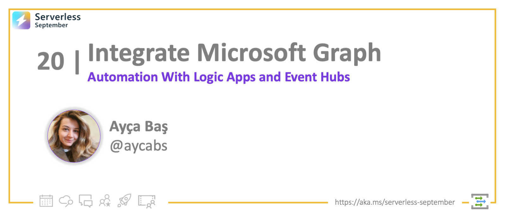
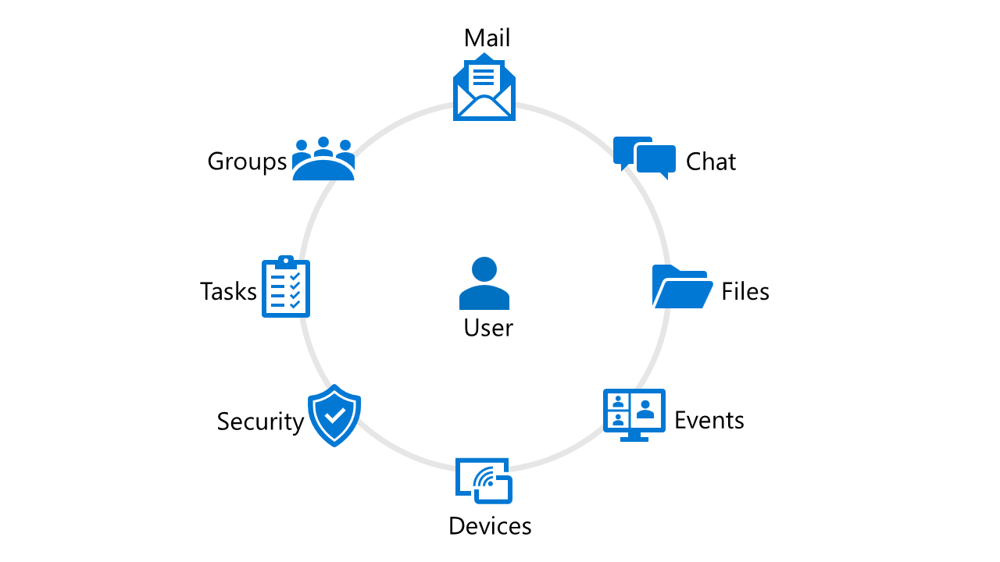
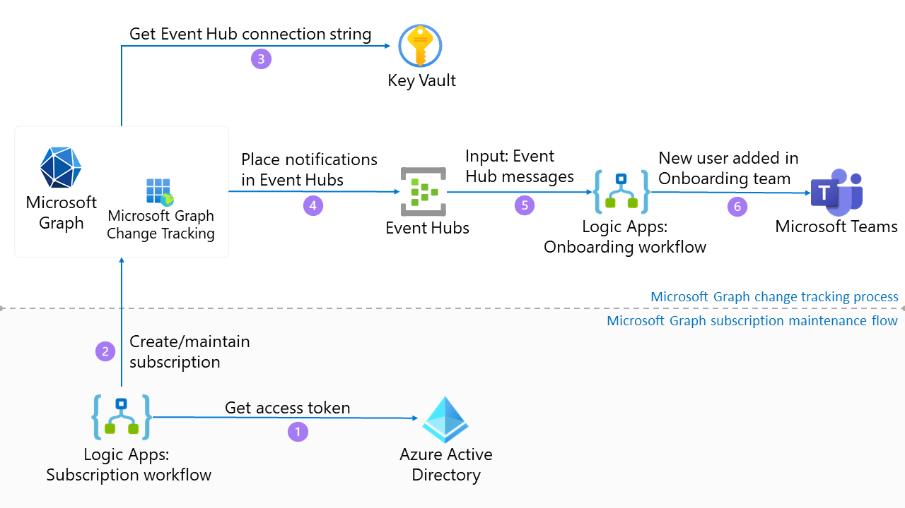
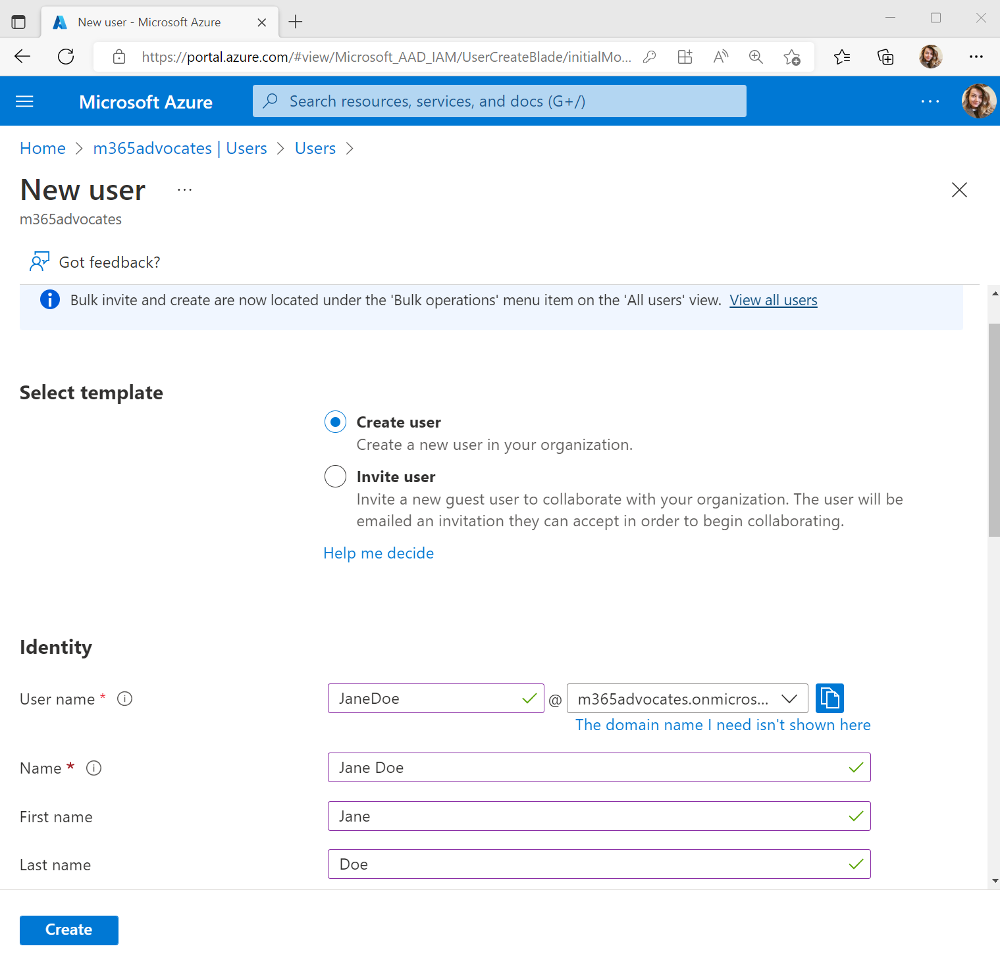
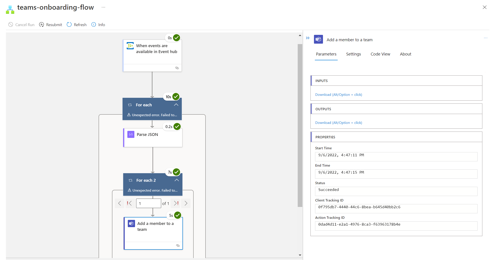
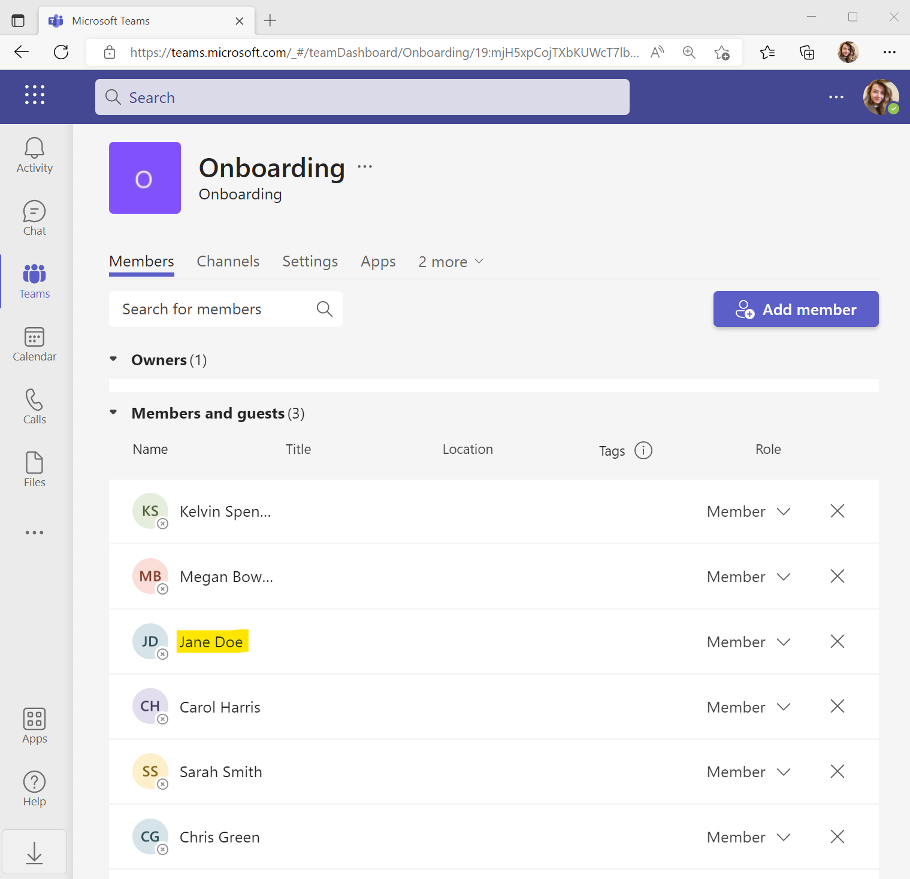

<!-- FIXME -->
<head>
  <meta name="twitter:url" 
    content="https://azure.github.io/Cloud-Native/blog/functions-1" />
  <meta name="twitter:title" 
    content="#30DaysOfServerless: Azure Functions Fundamentals" />
  <meta name="twitter:description" 
    content="#30DaysOfServerless: Azure Functions Fundamentals" />
  <meta name="twitter:image"
    content="https://azure.github.io/Cloud-Native/img/banners/post-kickoff.png" />
  <meta name="twitter:card" content="summary_large_image" />
  <meta name="twitter:creator" 
    content="@nitya" />
  <meta name="twitter:site" content="@AzureAdvocates" /> 
  <link rel="canonical" 
    href="https://azure.github.io/Cloud-Native/blog/08-functions-azure" />
</head>

---
# Build seamless automations to boost productivity with Microsoft Graph, Event Hubs and Logic Apps
Every day millions of people spend their precious time in productivity tools. What if you use data and intelligence behind the Microsoft applications (Microsoft Teams, Outlook, and many other Office apps) to build seemsless automations and custom apps to boost productivity? In this post, we'll build a seamsless onboarding experience to new employees joining a company with the power of Microsoft Graph. 

## 📝 What We'll Cover
- ✨ The power of Microsoft Graph
- 🖇️ How do Microsoft Graph and Event Hubs work together?
- ⚒️ Exercise: Setup Azure Event Hubs and Key Vault
- 🪡 Exercise: Subscribe to `users` resource to receive change notifications by using Logic Apps
- ♾️ Exercise: Create Onboarding workflow in the Logic Apps
- 🚀 Debug your onboarding experience
- 📚 Resources





Following pre-requisites are recommended:
- [Microsoft 365 Developer Program account](https://aka.ms/m365developers)
- [Microsoft Azure Subscription](https://azure.microsoft.com/free/)

## ✨ The power of Microsoft Graph
Microsoft Graph is the gateway to data and intelligence in Microsoft 365 platform. Microsoft Graph exploses Rest APIs and client libraries to access data across Microsoft 365 core services such as Calendar, Teams, To Do, Outlook, People, Planner, OneDrive, OneNote and more.



You can build custom experiences by using Microsoft Graph such as automating the onboarding process for new employees. When new employees are created in the Azure Active Directory, they will be automatically added in the Onboarding team on Microsoft Teams. 


 
## 🖇️ How do Microsoft Graph and Event Hubs work together?
Microsoft Graph uses webhook mechanism to track changes in resources and deliver change notifications to the clients. As an example to the Microsoft Graph Change Notifications, you can receive change notifications when:
- a new task is added in the to-do list
- a user changes the presence status from busy to available
- an event is deleted/cancelled from the calendar

If you'd like to track a large set of resources in a high frequency, you can use Azure Events Hubs instead of traditional webhooks to receive change notifications. Azure Event Hubs is a popular real-time events ingestion and distribution service built for scale.

> Microsoft Graph Change Notifications can be also received by using Azure Event Grid that is currently available for Microsoft Partners. Please review the documentation for more information: [Partner Events overview for customers - Azure Event Grid](https://docs.microsoft.com/azure/event-grid/partner-events-overview)

## ⚒️ Exercise: Setup Azure Event Hubs and Key Vault 
To get Microsoft Graph Change Notifications delivered to Azure Event Hubs, we'll have to setup Azure Event Hubs and Azure Key Vault. We'll use Azure Key Vault to access to Event Hubs connection string. 

### 1️⃣ Create Azure Event Hubs
1. Go to [Azure Portal](https://portal.azure.com) and select **Create a resource**, type **Event Hubs** and select click **Create**.
1. Fill in the Event Hubs namespace creation details, and then click **Create**.
1. Go to the newly created Event Hubs namespace page, select **Event Hubs** tab from the left pane and **+ Event Hub**:
    - Name your Event Hub as *Event Hub*
    - Click **Create**.
1. Click the name of the Event Hub, and then select **Shared access policies** and **+ Add** to add a new policy:
    - Give a name to the policy
    - Check **Send** and **Listen**
    - Click **Create**.
1. After the policy has been created, click the name of the policy to open the details panel, and then copy the **Connection string-primary key** value. Write it down; you'll need it for the next step.
1. Go to **Consumer groups** tab in the left pane and select **+ Consumer group**, give a name for your consumer group as *onboarding* and select **Create**.

### 2️⃣ Create Azure Key Vault
1. Go to [Azure Portal](https://portal.azure.com) and select **Create a resource**, type **Key Vault** and select **Create**.
1. Fill in the Key Vault creation details, and then click **Review + Create**.
1. Go to newly created Key Vault and select **Secrets** tab from the left pane and click **+ Generate/Import**:
    - Give a name to the secret
    - For the value, paste in the connection string you generated at the Event Hubs step
    - Click **Create**
    - Copy the **name of the secret**.
1. Select **Access Policies** from the left pane and **+ Add Access Policy**:
    - For **Secret permissions**, select **Get** 
    - For Principal, select **Microsoft Graph Change Tracking**
    - Click **Add**.
1. Select **Overview** tab from the left pane and copy the **Vault URI**.

## 🪡 Exercise: Subscribe to `users` resource to receive change notifications by using Logic Apps
To start receiving Microsoft Graph Change Notifications, we'll need to create subscription to the resource that we'd like to track. We'll use Azure Logic Apps to create subscription. 

To create subscription for Microsoft Graph Change Notifications, we'll need to make a http post request to `https://graph.microsoft.com/v1.0/subscriptions`. Microsoft Graph requires Azure Active Directory authentication make API calls. First, we'll need to register an app to Azure Active Directory, and then we will make the Microsoft Graph Subscription API call with Azure Logic Apps.

### 1️⃣ Create an app in Azure Active Directory
1. In the [Azure Portal](https://portal.azure.com), go to **Azure Active Directory** and select **App registrations** from the left pane and select **+ New registration**. Fill in the details for the new App registration form as below:
    - Name: Graph Subscription Flow Auth
    - Supported account types: *Accounts in any organizational directory (Any Azure AD directory - Multitenant) and personal Microsoft accounts (e.g. Skype, Xbox)*
    - Select **Register**.
1. Go to newly registered app in Azure Active Directory, select **API permissions**:
    - Select **+ Add a permission** and **Microsoft Graph**
    - Select **Application permissions** and add `User.Read.All` and `Directory.Read.All`.
    - Select **Grant admin consent for *the organization***
1. Select **Certificates & secrets** tab from the left pane, select **+ New client secret**:
    - Choose desired expiry duration 
    - Select **Add** 
    - Copy the *value of the secret*.
1. Go to **Overview** from the left pane, copy *Application (client) ID* and *Directory (tenant) ID*.

### 2️⃣ Create subscription with Azure Logic Apps
1. Go to [Azure Portal](https://portal.azure.com) and select **Create a resource**, type **Logic apps** and select click **Create**.
1. Fill in the Logic Apps creation details, and then click **Create**.
1. Go to the newly created Logic Apps page, select **Workflows** tab from the left pane and select **+ Add**:
    - Give a name to the new workflow as *graph-subscription-flow*
    - Select **Stateful** as a state type
    - Click **Create**.
1. Go to *graph-subscription-flow*, and then select **Designer** tab.
1. In the Choose an operation section, search for **Schedule** and select **Recurrence** as a trigger. Fill in the parameters as below:
    - Interval: `61`
    - Frequency: `Minute`
    - Time zone: *Select your own time zone*
    - Start time: *Set a start time*
1. Select **+** button in the flow and select **add an action**. Search for **HTTP** and select **HTTP** as an action. Fill in the parameters as below: 
    - Method: `POST`
    - URI: `https://graph.microsoft.com/v1.0/subscriptions`
    - Headers:
        - Key: `Content-type`
        - Value: `application/json`
    - Body:
    ```json
    {
    "changeType": "created, updated",
    "clientState": "secretClientValue",
    "expirationDateTime": "@{addHours(utcNow(), 1)}",
    "notificationUrl": "EventHub:https://<YOUR-VAULT-URI>/secrets/<YOUR-KEY-VAULT-SECRET-NAME>?tenantId=72f988bf-86f1-41af-91ab-2d7cd011db47",
    "resource": "users"
    }
    ```
    > In `notificationUrl`, make sure to replace `<YOUR-VAULT-URI>` with the vault uri and `<YOUR-KEY-VAULT-SECRET-NAME>` with the secret name that you copied from the Key Vault.

    > In `resource`, define the resource type you'd like to track changes. For our example, we will track changes for `users` resource.
    - Authentication:
        - Authentication type: `Active Directory OAuth`
        - Authority: `https://login.microsoft.com`
        - Tenant: *Directory (tenant) ID* copied from AAD app
        - Audience: `https://graph.microsoft.com`
        - Client ID: *Application (client) ID* copied from AAD app
        - Credential Type: `Secret`
        - Secret: *value of the secret* copied from AAD app
1. Select **Save** and run your workflow from the **Overview** tab.
> **Check your subscription in Graph Explorer:** If you'd like to make sure that your subscription is created successfully by Logic Apps, you can go to [Graph Explorer](https://aka.ms/ge), login with your Microsoft 365 account and make `GET` request to `https://graph.microsoft.com/v1.0/subscriptions`. Your subscription should appear in the response after it's created successfully.


After subscription is created successfully by Logic Apps, Azure Event Hubs will receive notifications whenever there is a new user created in Azure Active Directory.

## ♾️ Exercise: Create Onboarding workflow in the Logic Apps
We'll create a second workflow in the Logic Apps to receive change notifications from Event Hubs when there is a new user created in the Azure Active Directory and add new user in Onboarding team on Microsoft Teams.

1. Go to the Logic Apps you created in the previous steps, select **Workflows** tab and create a new workflow by selecting **+ Add**:
    - Give a name to the new workflow as *teams-onboarding-flow*
    - Select **Stateful** as a state type
    - Click **Create**.
1. Go to *teams-onboarding-flow*, and then select **Designer** tab.
1. In the Choose an operation section, search for **Event Hub**, select **When events are available in Event Hub** as a trigger. Setup Event Hub connection as below:
    - Create Connection:
        - Connection name: `Connection`
        - Authentication Type: `Connection String`
        - Connection String: Go to **Event Hubs > Shared Access Policies > RootManageSharedAccessKey** and copy *Connection string–primary key*
        - Select **Create**.
    - Parameters:
        - Event Hub Name: `Event Hub`
        - Consumer Group Name: `onboarding`
1. Select **+** in the flow and **add an action**, search for **Control** and add **For each** as an action. Fill in For each action as below:
    - Select output from previous steps: `Events`
1. Inside For each, select **+** in the flow and **add an action**, search for **Data operations** and select **Parse JSON**. Fill in Parse JSON action as below:
    - Content: `Events Content`
    - Schema: Copy the json content from [schema-parse.json](../2022-09-20/img/schema-parse.json) and paste as a schema
  
1. Select **+** in the flow and **add an action**, search for **Control** and add **For each** as an action. Fill in For each action as below:
    - Select output from previous steps: `value`
1. 1. Inside For each, select **+** in the flow and **add an action**, search for **Microsoft Teams** and select **Add a member to a team**. Login with your Microsoft 365 account to create a connection and fill in Add a member to a team action as below:
    - Team: *Create an Onboarding team on Microsoft Teams and select*
    - A user AAD ID for the user to add to a team: `id`
1. Select **Save**.

## 🚀 Debug your onboarding experience
To debug our onboarding experience, we'll need to create a new user in Azure Active Directory and see if it's added in Microsoft Teams Onboarding team automatically.
1. Go to [Azure Portal](https://portal.azure.com) and select Azure Active Directory from the left pane and go to **Users**. Select **+ New user** and **Create new user**. Fill in the details as below:
    - User name: `JaneDoe`
    - Name: `Jane Doe`

    

1. When you added `Jane Doe` as a new user, it should trigger the *teams-onboarding-flow* to run.


1. Once the *teams-onboarding-flow* runs successfully, you should be able to see `Jane Doe` as a member of the Onboarding team on Microsoft Teams! 🥳


## 📚 Resources
- [Microsoft Graph Fundamentals](https://aka.ms/learn-graph)
- [Get change notifications delivered in different ways](https://docs.microsoft.com/graph/change-notifications-delivery)
- [Real-time presence with Microsoft 365, Azure, and Power Platform](https://docs.microsoft.com/azure/architecture/solution-ideas/articles/presence-microsoft-365-power-platform)
- [Partner Events overview for customers - Azure Event Grid](https://docs.microsoft.com/azure/event-grid/partner-events-overview)

